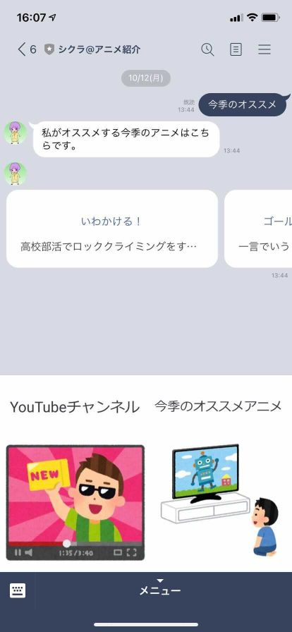
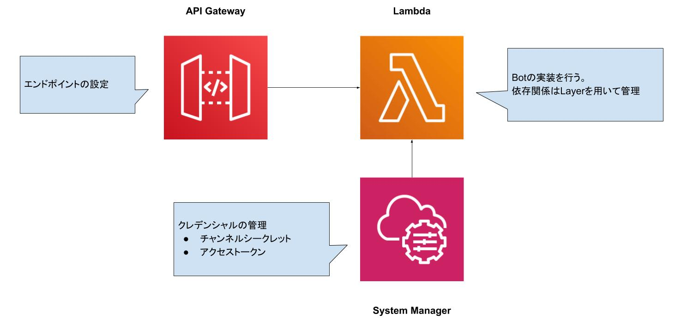
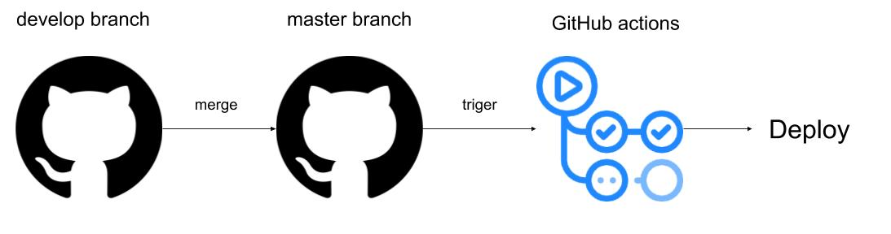
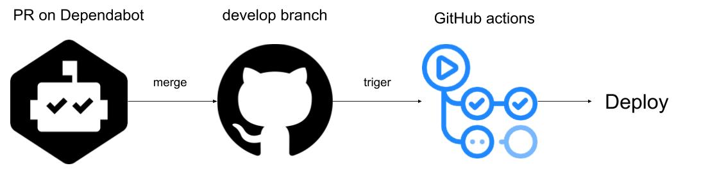

# AWS CDKでLINE BotのDevOpsをやってみる

+++

### 自己紹介

- 名前
  - 松永勇太
- 出身
  - 滋賀県
- 居住
  - 埼玉県
- 職業
  - エンジニア
- I'm not LINE API Expert
  
+++

### Topics

1. メインワードについて
  - DevOps
  - AWS CDK
2. AWS CDKを使うメリット
3. AWS CDKを使ったLINE Bot開発について
4. LINE BotのDevOpsを考えてみる
  - 開発と運用それぞれの環境をわける
  - デプロイの管理
  - パッケージの更新
5. まとめ

+++

### はじめに

このセッションでお話することは、*LINE BotのDevOps的なものを考えてみた*の単なる一例です。開発方法（特にDevOps）に正解はないと思いますので、開発ツールの参考程度で聞いていただけると幸いです。

+++

### 今回話さないこと

- Messaging APIを用いたBot開発についての基礎知識
  - 「*オウム返しBot*を作ったことある」程度の知識がある前提で話を進めます
- AWSを使ったクラウド開発についての基礎知識
  - *AWS CDK*についてはちゃんとお話します

---

### メインワードについて

*DevOps*と*AWS CDK*について簡単に説明します。後者については以降の節でもう少し掘り下げてお話します。

+++

### DevOps

*Development（開発）*と*Operation（運用）*の混成語。

開発チームと運用チームが協力してより質の高いプロダクト・サービスを提供する取り組みを示す概念みたいなもの。DevOpsは色んな文脈で用いられますが、このセッションでは*開発と運用の両立の方法*に視点を置きます。

+++

### AWS CDK

AWS Cloud Development Kit(AWS CDK)は、使い慣れたプログラミング言語を使用してクラウドアプリケーションリソースを定義するためのオープンソースのソフトウェア開発フレームワークです([公式サイトより](https://aws.amazon.com/jp/cdk/))。

Cloud Formationの機能を使って、AWSのクラウド構成を簡単にデプロイ・削除することができる。

---

### AWS CDKを使うメリット

AWS CDKを使うメリットについて説明するために、*プロビジョニング*(クラウドの環境構築)の管理ついて深堀りしてみます。以降の内容は[この記事から引用](https://qiita.com/ufoo68/items/d06756b6e7bb97359074)します。

+++

### プロビジョニングを管理したい理由

クラウドを構築する手っ取り早い方法は[マネジメントコンソール](https://aws.amazon.com/jp/console/)を使ってGUIをポチポチ触りながら構築していく方法です。しかしこの方法でクラウドを構築してしまうと同じ構成をコピーしたいとき、構築手順や設定値を管理したい時にものすごく面倒なことになります。


+++

### テンプレートファイルでの管理

[CloudFormation](https://aws.amazon.com/jp/cloudformation/)を用いてテンプレートファイルでクラウドの構成を管理する方法があります。構成ファイルは`json`や`yaml`の形式で書くことができます。

```json
{
  "Type" : "AWS::DynamoDB::Table",
  "Properties" : {
    "AttributeDefinitions": [ { 
      "AttributeName" : {"Ref" : "HashKeyElementName"},
      "AttributeType" : {"Ref" : "HashKeyElementType"}
  } ],
}
```

+++

### CloudFormationのここがつらい

- テンプレートファイルの記法を一々ドキュメントで確認しにいく必要がある
- 構文エラーチェックがやりにくい
- 共通化したいところは自分でスクリプトを書くことになる


+++

### AWS CDKでの構成管理

*AWS CDK*ではいくつかのプログラミング言語で構成を記述することができる。

```typescript
export class CdkStack extends cdk.Stack {
  constructor(scope: cdk.App, id: string, props?: cdk.StackProps) {
    super(scope, id, props)
    const table = new dynamodb.Table(this, 'Table', {
      partitionKey: { name: 'key', type: dynamodb.AttributeType.STRING }
    })
  }
}
```

+++

### AWS CDKのいいところ

- エディタの補完を使うと公式ドキュメントを確認する手間が省ける
- 型を使って構文のエラーチェックができる
- ライブラリ（もしくはnpmパッケージ作成）で共通化ができる

+++

更にくわしい内容は[こちらの公式の資料](https://aws.amazon.com/jp/blogs/news/webinar-bb-aws-cloud-development-kit-cdk-2020/)を見てもらうとして、次からAWS CDKを使ったLINE Bot開発の例をお見せします。

---

### AWS CDKを使ったLINE Bot開発について

今回は自分の[YouTubeチャンネル](https://www.youtube.com/channel/UCYp4_ZzpgjMhImlDyXQTKjg)用のLINE Botをつくってみました。



+++

### システム構成



+++

### AWS Systems Managerについて

このサービス自体には色々な機能が提供されているが今回用いたのは[AWS Systems Manager パラメータストア](https://docs.aws.amazon.com/ja_jp/systems-manager/latest/userguide/systems-manager-parameter-store.html)。目的はMessaging　APIを利用するためのクレデンシャル情報（チャンネルシークレットトークン・アクセストークン）の管理。

+++

### システムの構築方法

今回はTypeScriptを用いてシステムを構築。具体的な実装としては`Stack`というClassを定義してAWSリソースを定義していく。

```typescript
export class ShikuraLineBotStack extends cdk.Stack {
  constructor(scope: cdk.Construct, id: string, target: Environments, props?: cdk.StackProps) {
    super(scope, id, props)
    // ここにリソースを定義していく
  }
}
```

+++

### 外部パッケージの管理

LINE Bot実装のためのパッケージ(`@line/bot-sdk`など)を[AWS Lambdaレイヤー](https://docs.aws.amazon.com/ja_jp/lambda/latest/dg/configuration-layers.html)を用いて管理。

+++

### パッケージインストールの使い分け

- CDKや型定義などアプリケーションと直接関係しないバッケージを`devDependencies`
- Lambdaで用いるアプリケーションと関係するパッケージを`dependencies`

Lambdaレイヤーで管理するのは`dependencies`に限定する。

+++

### ESLintの導入

vscodeでの開発を快適にするために[ESLint](https://eslint.org/)をつかってみました。使う利点は、

- `;`無し（もしくは有り）の統一
- インデントの空白の文字数
- etc

などのプログラム記述に関するルールを強制することができます。

---

### LINE BotのDevOpsについて考えてみる

今回は以下の３つに着目してみました。

- 開発と運用それぞれの環境をわける
- デプロイの管理
- パッケージの更新

+++

### 開発と運用それぞれの環境をわける

CDKの[Context機能](https://docs.aws.amazon.com/cdk/latest/guide/context.html)を使用

```
cdk deploy -c key=value
```

+++

### Contextの値の取得と利用

`tyrGetContext`を用いて取得。各`target`ごとにスタックIDを分けて`dev`と`prod`のスタックの分離する。

```typescript
const target: Environments = app.node.tryGetContext('target')
new ShikuraLineBotStack(app, `ShikuraLineBotStack-${target}`, target)
```

+++

### 開発用のLINE Botの作成

現状では公式で開発環境用のLINE Bot作成機能の提供がされていないので開発用のチャンネルを作成しました。


+++

### デプロイの管理

masterブランチへのマージ＋GitHub Actionsを用いた本番デプロイ



+++

### パッケージの更新

[Dependabot](https://dependabot.com/)を用いて継続的にパッケージの更新＋開発環境へのデプロイを行う



---

### まとめ

- CDKを用いたLINE BotのDevOpsの一例を見せた
  - AWS上でのシステムをすべてTypeScriptで管理した
  - `dev`と`prod`の分離を行った
- dependabotとGitHub Actionsを用いてGitHub内でのCI/CDを行った

+++

### さいごに

- 公式の情報
  - [ドキュメント](https://docs.aws.amazon.com/cdk/api/latest/index.html)
  - [ハンズオン](https://cdkworkshop.com/)
  - [AWS Black Belt Online Seminar](https://aws.amazon.com/jp/blogs/news/webinar-bb-aws-cloud-development-kit-cdk-2020/)
- 参考記事
  - [AWS CDK + Typescript 環境で lambda layer を上手く管理する](https://qiita.com/hey3/items/b4032841b01e96b75e3e)
  - [LINEアプリのサンプルをCDKで書き直して見て、その凄さを実感しました](https://dev.classmethod.jp/articles/aws-cdk-line-sample/)
  - [スタック名に本番環境と開発環境の名前を含めて、それぞれデプロイしてみた](https://dev.classmethod.jp/articles/aws-cdk-deploy-dev-and-prod-stack/)
